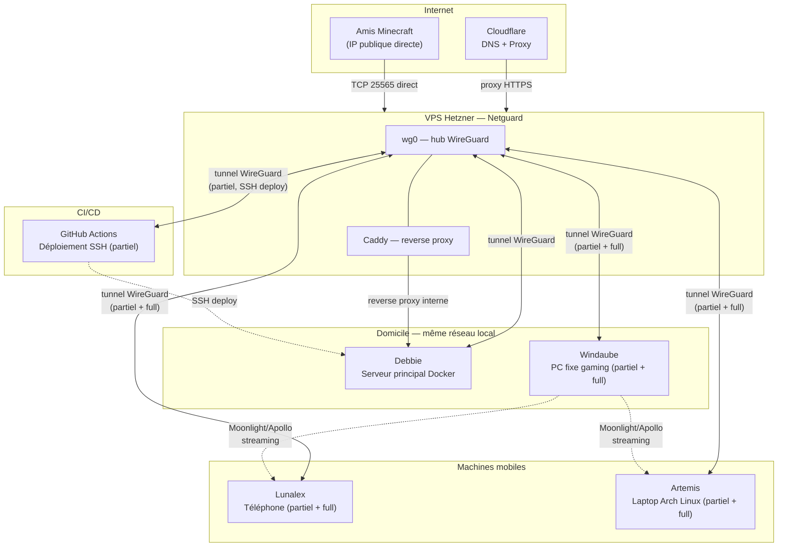

# 01 — Architecture générale

## Vue d'ensemble

L'infrastructure repose sur un **hub WireGuard unique** (VPS Hetzner) faisant office de routeur central et de point d'entrée public (reverse proxy). Aucune redondance n'est en place : le VPS est un point de défaillance unique (SPOF), assumé pour une infrastructure personnelle.

Deux catégories de peers coexistent :
- **Partiel** : seul le trafic à destination du réseau interne transite par le tunnel.
- **Full-tunnel** : tout le trafic internet de la machine transite par le VPS (façon VPN classique).

## Topologie

## Principes directeurs

- **`172.30.0.0/16` = cercle de confiance total.** Toute machine qui y est connectée (peu importe le sous-réseau, partiel ou full) est considérée de confiance et peut atteindre tous les services exposés en interne. Il n'existe volontairement aucune microsegmentation entre peers à ce stade.
- **Pas de SSO.** Chaque service dispose de sa propre authentification, afin d'éviter la réplication d'identifiants et de limiter l'impact d'une compromission unique.
- **Séparation des rôles Netguard / Debbie** : Netguard ne fait que router et exposer (WireGuard + Caddy), aucune donnée applicative n'y réside. Debbie concentre tous les services (Docker).
- **Roadmap de segmentation** : en cas d'ouverture future du réseau à des tiers (`172.40.0.0/16` réservé à cet usage), des règles `FORWARD` explicites isoleront ce sous-réseau du cercle de confiance `172.30.0.0/16`.
